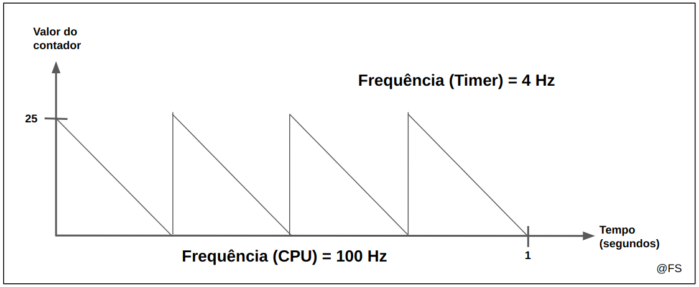

# **Lab 2 - Timer**

## **1. Funções de teste esperadas**

Devemos implementar três funções de teste principais:
- **timer_test_read_config:** para ler e mostrar a configuração do timer;
- **timer_test_time_base:** para configurar um timer com uma frequência específica;
- **timer_test_int:** para testar a gestão de interrupções do timer (vamos ver o que é isso no ponto #7)

Para implementar as duas primeiras funções recomendo a leitura atenta na íntegra dos pontos 2 a 5.

Para a última função, não só é necessário compreender como funciona a comunicação com os timers como também é preciso perceber o que são interrupções e como são abordadas. Para tal recomendo a leitura do [ponto 6](https://github.com/tiagoleic02/LCOM/tree/master/lab2#6-interrup%C3%A7%C3%B5es).

## 2. Ponto de partida: ficheiros necessários

Neste lab irás precisar de criar os seguintes ficheiros:
- **`utils.c`**: Para implementar as funções relacionadas com o teclado:
  - `util_sys_inb` - Conversão do apontador de 32 bits em 8 bits;
  - `util_get_LSB` - Obter os LSB do counter;
  - `util_get_MSB` - Obter os MSB do counter.
- **`timer.c`**: Implementa funções de baixo nível para comunicação direta com o i8042:
  - `timer_get_conf` - Obter a configuração atual de um dado timer
  - `timer_display_conf` - Mostrar a configuração atual de um dado timer;
  - `timer_set_frequency` - Altera a configuração (frequência) de um dado timer;
  - `timer_subscribe_int` - Subscreve interrupções do timer;
  - `timer_unsubscribe_int` - Cancela a subscrição de interrupções.

Também irás precisar do ficheiro `i8254.h` que já vem definido e do `lab2.c`, fornecido nos documentos do laboratório.

Neste [link]() tens o molde deste lab que podes descarregar para trabalhar a partir do mesmo. Tens ao teu dispôr:
- Ficheiro `i8254.h`;
- Ficheiros acima descritos com os `#includes` já prontos e funções declaradas;
- `lab2.c` conforme é fornecido nos documentos de LCOM;

Trabalha nos ficheiros que te forneci (`.c`) seguindo o guião deste laboratório e se tiveres alguma dúvida ou sugestão de melhoria abre uma [discussão](https://github.com/tiagoleic02/LCOM/discussions/new/choose).

## **3. Funcionamento do Timer (i8254)**

### **📌 O que é?**

O temporizador do computador, conhecido como i8254, é um dos componentes de _‘hardware’_ mais simples que conseguimos programar em linguagem C.

### **🧱 Estrutura do i8254**

O temporizador tem 3 contadores de 16 bits (uint16_t), cada um com uma função específica:
~~~lua
+------------+------------+-------------------------------------------+
|   Timer    |  Endereço  |                 Função                    |
+------------+------------+-------------------------------------------+
|  Timer 0   |    0x40    | Fornece uma base de tempo ao sistema      |
|  Timer 1   |    0x41    | Faz refresh da memória DRAM               |
|  Timer 2   |    0x42    | Gera tons/frequências para os speakers    |
+------------+------------+-------------------------------------------+
|  Control   |    0x43    | Registo de controlo (envio de comandos)   |
+------------+------------+-------------------------------------------+
~~~
### **💬 Comunicação com o i8254 em C**

Quando falamos em comunicar com o timer, falamos em duas hipóteses:
- Receber informações do timer;
- Enviar informações (alterar configurações) do timer;

Em qualquer comunicação com o timer temos **sempre** que informar o registo de controlo (0x43) para ele 'ficar a contar' com o que pretendemos fazer. Só após o registo de controlo ter do lado dele a informação daquilo que pretendemos fazer (enviar ou receber a configuração de um timer especifico p.e.) é que podemos efetivamente recolher ou enviar essa informação.

Para isso, usamos duas system calls:

#### 🔽 _sys_outb_ — **Envia comandos/informações para o timer**
~~~C
int sys_outb(uint8_t port, uint32_t command);
~~~
**Para que serve:** enviar configurações para os timers (por exemplo, definir como contam ou com que frequência) ou para o registo de controlo.

**Exemplo:**
~~~C
sys_outb(0x43, 0x36); // Envia um comando de configuração para o registo de controlo, informando o mesmo do que pretendemos fazer (neste caso, alterar a configuração do timer 0)
sys_outb(0x40, 0x9C); // Altera o valor do timer 0, enviando-lhe uma nova configuração
~~~
#### 🔼 _sys_inb_ — **Recebe informação do timer**
~~~C
int sys_inb(uint8_t port, uint32_t *value);
~~~
**Para que serve:** consultar o valor atual de um dos timers.

**Exemplo:**
~~~C
uint32_t val;
sys_inb(0x40, &val);  // Lê o valor atual do Timer 0 e guarda em val
~~~

### Nota #1 - Função _util_sys_inb_:

Repara que o comando sys_inb que lê informações do timer recebe um valor por um apontador de 32 bits. No entanto, é dispensável esses 32 bits, pois no contexto de LCOM apenas são necessários 8 e essa diferença leva muitas vezes a erros desnecessários.
> **_Qual a alternativa para evitar esses erros?_** --> Implementar uma função auxiliar que receba esse apontador e converta em 8 bits
~~~C
int (util_sys_inb)(int port, uint8_t *value) {
  if(value == NULL) return 1;
  uint32_t temp;
  int result = sys_inb(port, &temp); //Chamada do sys_inb para ler da porta
  *value = (uint8_t)temp; //Converter o valor de temp para uint8_t - é este o objetivo desta função!
  return result; //retornar para esta nova função o mesmo valor que a função original também retornava
}
~~~

### Nota #2 - Configuração da frequência do timer usando MSB e LSB [*1](https://github.com/tiagoleic02/LCOM/tree/master/lab2#refer%C3%AAncias)
Como já deves ter percebido, no caso de querermos alterar a configuração/frequência de um timer, após passar a informação para o registo de controlo sobre a alteração que pretendemos fazer, é necessário injetar o valor inicial no timer da porta correspondente (0x40, 0x41 ou 0x42).

Cada contador tem um valor interno que é decrementado conforme a frequência do CPU. No caso do MINIX é decrementado 1193182 vezes por segundo. Sempre que o valor do contador fica a 0 o dispositivo notifica o CPU (gera uma interrupção, veremos no ponto 6 o que é) e volta ao valor original.

Por exemplo, para um CPU de frequência 100 Hz e um Timer de 4 Hz precisamos de ter o contador com valor 25 (counter = CPU_frequency / TIMER_frequency). Esquema ilustrativo:

  
  
Cálculo do valor do contador interno (ver referência 1)

Para alterar a frequência do timer selecionado, de modo a conseguirmos por exemplo contar segundos (com uma frequência de 60Hz) através das interrupções geradas, devemos calcular o valor interno.

~~~C
#define CPU_frequency 1193182
uint16_t TIMER_frequency = 60;
uint16_t counter = CPU_frequency / TIMER_frequency;
~~~

Para configurar o timer com este valor, temos que usar o _**sys_outb**_. Mas essa função só aceita valores de 8 bits...

> **_Então porque não definimos a variável counter como uma variável de 8 bits?_** 
Porque não é possivel alojar um número tão grande como uma divisão de 1193182 por 60 em apenas 8 bits!

Por esse mesmo motivo é que não só temos que separar os 16 bits em 8+8 (ou **MSB+LSB**) como ainda temos que garantir que o valor da frequency nunca é menor do que 19 (pois se for 18, counter é 66288 e o máximo suportado por uma variável de 16 bits é 65535). 

Para enviar os 8 bits mais significativos (Most Significant Bits ou MSB) seguido dos 8 bits menos significativos (Less Significant Bits ou LSB), temos que definir duas funções para o efeito. Estas devem ser incluídas no utils.c:
~~~C
int(util_get_LSB)(uint16_t val, uint8_t *lsb) {
  if (lsb == NULL) return 1; // Verificar se o apontador lsb é válido
  *lsb = (uint8_t)(val & 0xFF);  // Passar para o lsb apenas os 8 bits menos significativos de val;
  return 0;
}

int(util_get_MSB)(uint16_t val, uint8_t *msb) {
  if (msb == NULL) return 1; // Verificar se o apontador msb é válido
  *msb = (uint8_t)(val >> 8); //Deslocar 8 bits para a direita e passar tal como no lsb os restantes 8 bits do val para o msb
  return 0;
}
~~~
O resto é feito pelo _Configuration Command_, que veremos no ponto seguinte o que faz e de que forma envia o MSB + LSB.

### Resumindo...

- Cada timer tem o seu endereço (0x40, 0x41, 0x42);
- O registo 0x43 serve para dizer ao timer como se deve comportar;
- Usamos:
  - sys_outb() → para escrever nos timers ou no registo de controlo;
  - sys_inb() → para ler os valores dos timers.
- A frequência do timer é independente da velocidade do processador, o que permite medir o tempo com fiabilidade.

## **4. Programação do Timer**

Para programar um timer é necessário:
- **Escrever um código de 8 bits no registo de controlo 0x43** (especificando o modo de operação);
- **Carregar o valor inicial do contador;**

A palavra de controlo inclui:
- Bits 7,6: Seleção do contador (00 para timer 0, 01 para timeer 1, 10 para timer 2);
- Bits 5,4: Modo de inicialização (01 só LSB, 10 só MSB, 11 LSB seguido de MSB*);
- Bits 3, 2, 1: Modo de operação (011 para modo 3 que será o que vamos usar maioritariamente);
- Bit 0: Base de contagem (0 para binário, 1 para BCD).

### _Configuration Command:_
~~~lua
+-------+---------+---------------------------+
|  Bit  |  Value  |         Função            |
+-------+---------+---------------------------+
|  7,6  |         |      Timer selecion       |
+-------+---------+---------------------------+
|       |    00   |            0              |
|       |    01   |            1              |
|       |    10   |            2              |
+-------+---------+---------------------------+
|  5,4  |         |    Modes of Read/Write    |
+-------+---------+---------------------------+
|       |    00   |          Latch            | Apenas Leitura
|       |    01   |           LSB             | Escrever só LSB
|       |    10   |           MSB             | Escrever só MSB
|       |    11   |    LSB folowed by MSB     | Escrever LSB e depois MSB
+-------+---------+---------------------------+
| 3,2,1 |         |      Operation Mode       |
+-------+---------+---------------------------+
|       |   000   |            0              | Interrupção terminal (one-shot)
|       |   001   |            1              | Programável em tempo (retriggerable)
|       |   x10   |            2              | Modo Rate Generator
|       |   x11   |            3              | Modo Square Wave Generator (onda quadrada) <- vamos usar maioritariamente este
|       |   100   |            4              | Software Triggered Strobe
|       |   101   |            5              | Hardware Triggered Strobe
+-------+---------+---------------------------+
|   0   |         |           BCD             |
+-------+---------+---------------------------+
|       |    0    |     Binary (16 bits)      |
|       |    1    |      BCD (4 digits)       | (raramente usado)
+-------+---------+---------------------------+
~~~

> Como devemos proceder para alterar a frequência de um timer usando um valor de 16 bits?

Tal como já foi visto na **Nota #2**, irei agora mostrar na prática como se processa todos os cálculos, incluindo a aplicação do "LSB followed by MSB" no _configuration command_.
~~~C
  //Ler a configuração atual para preservar alguns bits
  uint8_t st;
  if ((timer_get_conf(timer, &st)) != 0) return 1;

  // Preparar o comando para configurar o timer
  uint8_t ctrl_word = (st & 0x0F) | TIMER_LSB_MSB;  // Preservar os 4 bits menos significativos e definir modo de acesso

  // Selecionar o timer correto
  switch (timer) {
    case 0: ctrl_word |= TIMER_SEL0; break;
    case 1: ctrl_word |= TIMER_SEL1; break;
    case 2: ctrl_word |= TIMER_SEL2; break;
  }
  //Enviar o comando para o registo de controlo
  if ((sys_outb(TIMER_CTRL, ctrl_word)) != 0) return 1;
  
    // Calcular o valor de contagem baseado na frequência
  uint16_t initial_count = CPU_FREQ / TIMER_freq;

  //Obter o LSB e MSB do valor de contagem
  uint8_t lsb, msb;
  util_get_LSB(initial_count, &lsb);
  util_get_MSB(initial_count, &msb);

  //Enviar o valor de contagem para o timer
  if ((sys_outb(TIMER_0 + timer, lsb)) != 0) return 1;
  if ((sys_outb(TIMER_0 + timer, msb)) != 0) return 1;
~~~

Como penso ser óbvio, devem implementar uma configuração semelhante a esta no _timer_set_frequency_, no _timer.c_

### Nota #3: Regra básica de configuração de um timer

Sempre que quisermos enviar uma nova configuração para um timer, não só devemos avisar o registo de controlo como também devemos consultar primeiro qual a configuração que lá está e alterar nessa configuração apenas o necessário para evitar erros desnecesários. É por isso mesmo que chamamos a função _timer_get_config_ dentro da função _timer_set_frequency_

## **5. Leitura da configuração**

Tal como quando vamos escrever, para ler a configuração de um timer é necessário usar o comando Read-Back.
Para ler temos então que:
1. _Escrever o comando Read-Back no registo de controlo._

### _Read-Back Command Format_
~~~lua
+-------+---------+-----------------------------------+
|  Bit  |  Value  |              Função               |
+-------+---------+-----------------------------------+
|  7,6  |         |         Read-Back Command         |
+-------+---------+-----------------------------------+
|       |    11   |                                   | Se for 11 → indica que é um Read-Back Command
+-------+---------+-----------------------------------+
|   5   |         |              COUNT                |
+-------+---------+-----------------------------------+
|       |    0    |        Read counter value         | Se for 0 → queremos ler o valor do contador
+-------+---------+-----------------------------------+
|   4   |         |              STATUS               |
+-------+---------+-----------------------------------+
|       |    0    |       Read programmed mode        | Se for 0 → queremos ler o estado de configuração
+-------+---------+-----------------------------------+
|   3   |         |          Select Timer 2           |
+-------+---------+-----------------------------------+
|       |    0    |                No                 |
+-------+---------+-----------------------------------+
|   2   |         |          Select Timer 1           |
+-------+---------+-----------------------------------+
|       |    0    |                No                 |
+-------+---------+-----------------------------------+
|   1   |         |          Select Timer 0           |
+-------+---------+-----------------------------------+
|       |    1    |                Yes                |
+-------+---------+-----------------------------------+
|   0   |         |             Reserved              |
+-------+---------+-----------------------------------+
~~~
2. _Ler os 8 bits do timer selecionado através do comando **sys_inb**._

## **6. Implementação**

Já vimos toda a base que precisamos para implementar as duas primeiras funções referidas no ponto 1.

Apesar de ambas virem pré-definidas no lab2.c, para que as mesmas funcionem é preciso implementar funções importantes no timer.c, como:
~~~C
//Para obter a configuração atual de um dado timer
int (timer_get_conf)(uint8_t timer, uint8_t *st)

//Para mostrar a configuração atual de um dado timer, traduzindo a configuração obtida interpretando cada um dos bits segundo a tabela de Read-Back Command
int (timer_display_conf)(uint8_t timer, uint8_t st, enum timer_status_field field)

//Para alterar a configuração (frequência) de um dado timer 
int (timer_set_frequency)(uint8_t timer, uint32_t freq)
~~~
> Mas como fazemos para implementar cada uma destas funções? Abaixo deixo os passos necessários a cumprir em cada uma das funções. Se mesmo assim não compreenderes, consulta o meu [_timer.c_](https://github.com/tiagoleic02/LCOM/blob/master/lab2/timer.c). Tenta consultar este ficheiro unicamente **em último recurso** e, se possível, apenas para confirmar se o teu código ficou conforme esperado. _Copiar na íntegra o seu conteúdo não te vai tornar expert na matéria ou um excelente profissional._

### **1. _timer_get_conf_**

1. Certificar que os argumentos recebidos são todos válidos;
2. Preparar comando Read-Back para ler o status do timer especifico;
3. Enviar comando para o registo de controlo;
4. Ler o status do timer selecionado.

### **2. _timer_display_conf_**

1. Certificar que os argumentos são todos válidos;
2. Criar uma _union_ do tipo **timer_status_field_val** - esta _union_ é semelhante às structs de C++ e está definida em LCF;
3. Passar a informação da _union_ do tipo **timer_status_field** para a _union_ do tipo **timer_status_field_val**;
4. Exibir a informação formatada via _timer_print_config_, usando a nova _union_ **timer_status_field_val**.

### **3. _timer_set_config_**

1. Certificar que os argumentos são todos válidos, sem esquecer o que falamos sobre os valores mínimos da frequência na **Nota #2**;
2. Ler a configuração atual para preservar alguns bits;
3. Calcular o valor de contagem baseado na frequência;
4. Preparar o comando para configurar o timer, preservando os 4 bits inferiores, definindo corretamente o modo de acesso e o timer que queremos;
5. Enviar o comando para o registo de controlo;
6. Obter o LSB e MSB do valor de contagem;
7. Enviar o valor de contagem para o timer;

Depois de configuradas as 3 funções, chegou a altura de passar para o _lab2.c_ onde devemos configurar as funções _timer_test_read_config_ e _timer_test_time_base_.

### **4. _timer_test_read_config_**

1. Certificar que os argumentos são todos válidos;
2. Ler a configuração do timer (status byte) via _timer_get_conf_;
3. Chamar _timer_display_conf_ para exibir a configuração.

### **5. _timer_test_time_base_**

1. Certificar que os argumentos são todos válidos;
2. Configurar a frequência do timer usando _timer_set_frequency_.

Como deves ter reparado, existem mais funções no _timer.c_ para implementar, funções essas que irão permitir construir a função _timer_test_int_. Para isso temos que falar primeiro de [Interrupções](https://github.com/tiagoleic02/LCOM/blob/master/lab2/README.md#6-interrup%C3%A7%C3%B5es-1)

### Nota #4: Rigor na escrita de funções

Muitas vezes, por estarmos habituados a desenvolver programas simples — com poucas funções e baseados apenas em variáveis locais — acabamos por não verificar se os **atributos ou funções que usamos são válidos.** No entanto, em programação de sistemas (como nos laboratórios que realizamos), todos os **argumentos e chamadas a funções** podem **falhar por múltiplos motivos** (parâmetros inválidos, falhas de hardware, permissões, etc.).

Por isso, é essencial **adotar a semântica comum dos valores de retorno das system calls POSIX**, ou seja:

    - Retornar 0 em caso de sucesso;
    - Retornar um valor diferente de 0 (tipicamente 1) em caso de erro.

Além disso, é boa prática:

    - Verificar explicitamente os valores de retorno das funções;
    - Usar mensagens de erro informativas (por exemplo com perror() ou strerror() em C).

## **7. Interrupções**

As interrupções são mecanismos fundamentais nos sistemas computacionais modernos que **permitem a comunicação entre hardware e software de forma eficiente**. Sem elas, a comunicação entre o CPU e os dispositivos I/O tem que ser feita via **polling**, em que o CPU monitoriza o estado do dispositivo periodicamente e quando este tiver alguma informação útil ao sistema essa informação é tratada - desaconselhado geralmente, **pois gasta muitos ciclos de relógio na monitorização**.

  
  
Filha pergunta ao pai se já chegaram a todo o minuto. No exemplo de Interrupts, o pai diz à filha quando chegam e só aí é que ela acorda. Elaborado com IA.

### **_O que são interrupções?_**

Uma interrupção é um sinal enviado ao processador que indica a ocorrência de um evento que requer atenção imediata. Quando uma interrupção ocorre, o processador "interrompe" o que estava a fazer, salva o estado atual e transfere o controlo para uma rotina específica chamada "manipulador de interrupção" (interrupt handler).

### **_Para que servem as interrupções?_**

As interrupções servem para permitir que o processador:
1. **Responda a eventos assíncronos:** Eventos que ocorrem independentemente da execução do programa atual (como pressionar uma tecla ou receber dados pela rede);
2. **Utilize hardware de forma eficiente:** Em vez de verificar constantemente (polling) se um dispositivo precisa de atenção, o processador pode executar outras tarefas e ser notificado apenas quando necessário;
3. **Gerencie múltiplas tarefas:** Permite que o sistema operacional alterne entre diferentes programas e processos, implementando multitarefa;
4. **Lide com erros e exceções:** Permite que o sistema detete e responda a condições excecionais como divisão por zero ou acesso inválido à memória.

### **_Tipos de interrupções_**

1. **Interrupções de ‘hardware’:** Geradas por dispositivos externos como teclado, mouse, timer, discos, placas de rede, etc;
2. **Interrupções de ‘software’ (traps):** Geradas intencionalmente por programas para solicitar serviços ao sistema operativo (system calls);
3. **Exceções:** Geradas pelo próprio processador quando deteta condições anormais durante a execução (‘overflow’, divisão por zero, etc.).

Para ativar as interrupções é necessário subscrevê-las por meio de uma system call e antes de acabar o programa deve-se desligar as interrupções usando outra, para garantir a reposição do estado inicial da máquina. Por norma o bit de interrupção é definido pelo módulo que gere o próprio dispositivo, para que seja independente do programa.

Para esse efeito usamos 3 funções:

1. **_timer_subscribe_int_**: Esta função regista um manipulador de interrupção para o timer, subscrevendo a interrupção através da função _sys_irqsetpolicy_ (ver nota #5) ;
2. **_timer_int_handler_**: Manipulador de interrupção que será executado cada vez que o timer gerar uma interrupção. Serve para incrementar o contador a cada interrupção;
3. **_timer_unsubscribe_int_**: Esta função cancela o registo do manipulador de interrupção, comunicando ao sistema que o programa não deseja receber mais notificações de interrupções do timer.

### Nota #5: função sys_irqsetpolicy

Esta função, tal como a função _sys_irqrmpolicy()_ já está pré-definida no Minix. Esta é uma função que regista o programa (ou driver) como um manipulador de interrupções para um dispositivo em específico. Em termos simples:
- Estabelece uma conexão entre um evento de hardware (interrupção) e o código que deve ser executado quando esse evento ocorre;
- Informa ao sistema operativo que o programa quer ser notificado quando uma determinada interrupção acontecer.

#### O que faz esta função no backstage?

Quando esta função é chamada, o sistema operativo:
1. **Regista o driver/programa:** Adiciona o programa/driver à lista de serviços que devem ser notificados quando a interrupção especificada ocorrer;
2. **Configura o harware:** Programa o controlador de interrupções (PIC - Programmable Interrupt Controller) para permitir interrupções na linha IRQ solicitada; 
3. **Atribui um identificador único:** Gera e retorna um ID exclusivo (através do parâmetro hook_id) que será usado para identificar a interrupção e respetivo driver/programa; 
4. **Estabelece políticas:** Configura como o sistema deve lidar com essa interrupção com base na política especificada.

#### Estrutura
~~~C
int sys_irqsetpolicy(int irq, int policy, int *hook_id);
~~~
**1. irq:**

    Significado: é o número da linha IRQ (Interrupt Request) a ser tratada; Pode ir de 0 a 15;
Valores comuns:
- 0: Timer do sistema;
- 1: Teclado
- 3: Porta serial COM2
- 4: Porta serial COM1
- 8: Relógio de tempo real
- 12: Mouse PS/2

Usamos TIMER0_IRQ (que é 0, está definido no i8254)

**2. policy (int)**

    Significado: Indica como o sistema deve lidar com a interrupção;

Opções comuns:
- IRQ_REENABLE: Reativa automaticamente a linha de interrupção após cada tratamento;
- IRQ_EXCLUSIVE: Solicita uso exclusivo da linha de interrupção;
- IRQ_REENABLE | IRQ_EXCLUSIVE: Combina ambas as políticas;
- IRQ_REENABLE_NOTIFICATION: Ativa uma notificação centralizada para coordenar múltiplas interrupções;

Usamos a primeira opção para que o timer continue a gerar interrupções automaticamente após cada interrupção ser tratada.

**3.hook_id**

    Significado: é um identificador usado pelo sistema para rastrear a assinatura de interrupção especifica.
Uso:
- Entrada/Saída: É um parâmetro passado por referência;
- Antes de ser chamado: Inicializamos com o número da IRQ (hook_id = TIMER0_IRQ);
- Após ser chamado: O sistema modifica o valor para um ID único.

Importância:
- É necessário para desativar a interrupção posteriormente (em sys_irqrmpolicy());
- É usado para identificar qual o dispositivo que gerou uma interrupção (quando múltiplos dispositivos compartilham o mesmo IRQ);
- Serve como um ‘token’ que conecta o manipulador ao sistema de interrupções;

## **8. Implementação do _timer_test_int_**

Esta função já é dada praticamente concluída - basta consultar o ponto 5.2 da secção "Minix 3 Notes" da documentação para os labs fornecida (ver [referência 3](https://github.com/tiagoleic02/LCOM/tree/master/lab2#refer%C3%AAncias))

De forma resumida, deves:
1. Subscrever as interrupções usando _timer_subscribe_int_;
2. Fazer um loop de processamento de instruções tal e qual como consta no ponto 5.2. de "Minix 3 Notes";
3. Desativar as interrupções usando _timer_unsubscrive_int_.

No final, a função deve ficar com o seguinte aspeto:

~~~C
int(timer_test_int)(uint8_t time) {
  uint8_t irq_set;

  if (timer_subscribe_int(&irq_set) != 0) return 1;   //Subscrever interrupções

  //declaração de variáveis uteis para o ciclo while
  int ipc_status, r;
  message msg;
  int seconds = 0;   //Reiniciar contador que vai ser usado para o loop

  //Loop de processamento de interrupções
  while (seconds < time) {
    //Receber mensagem
    if ((r = driver_receive(ANY, &msg, &ipc_status)) != 0) {
      printf("driver_receive failed with: %d", r);
      continue;
    }
    if (is_ipc_notify(ipc_status)) { //Notificação recebida
      switch (_ENDPOINT_P(msg.m_source)) {
        case HARDWARE: //Notificação de interrupção do hardware
          if (msg.m_notify.interrupts & irq_set) { //subscreve a interrupção
            timer_int_handler();
            if (counter % 60 == 0) {
              timer_print_elapsed_time();
              seconds++;
            }
          }
          break;
        default:
          break; //não é esperado mais nenhuma notificação
      }
    }
  }

  if ((timer_unsubscribe_int()) != 0) return 1;   //Desativação das interrupções

  return 0;
}
~~~
## **9. Compilação**

O processo de compilação é direto graças ao Makefile fornecido. Este Makefile está configurado para compilar o programa usando os arquivos de código-fonte especificados na variável SRCS (lab2.c, timer.c e utils.c).

Antes de avançares, certifica-te que tens:
- **i8254.h:** Para constantes e macros úteis relacionadas com o _timer_;
- **utils.c:** Para implementar funções auxiliares (MSB, LSB e util_sys_inb);
- **timer.c:** Para implementar as funções do módulo i8254;
- **lab2.c:** Para implementar as funções solicitadas no enunciado do lab2.

Para compilar o programa deves fazer no Minix (ou via SSH):
~~~C
minix$ make clean
minix$ make
~~~
O comando _**make clean**_ remove todos os arquivos objeto (.o) gerados por compilações anteriores, enquanto _**make**_ compila os arquivos fonte modificados desde a última compilação.

## **10. Teste do código**

A biblioteca LCF (LCOM Framework) fornece um modo de teste para verificar se o teu código funciona como esperado. Para testar, usa o comando _lcom_run_ com argumentos específicos:

~~~C
 minix$ lcom_run lab2 
~~~

Sem argumentos, este comando mostrará informações sobre como usar o programa. Para testes específicos:

### 1. **Testar a configuração do timer (_timer_test_read_config_):**

~~~C
minix$ lcom_run lab2 "config <timer> <field> -t <test_no>"
~~~
- **'timer':** 0, 1 ou 2 (qual timer ler);
- **'field':** all, init, mode ou base (qual campo exibir);
- **'test_no':** 0, 1, 2 ou 3 (tipo de teste).

### **2. Testar a base de tempo (_timer_test_time_base_):**

~~~C
minix$ lcom_run lab2 "time <timer> <frequency> -t 0"
~~~
- **'timer':** 0, 1 ou 2;
- **'timer':** frequência em HZ.

### **3. Testar as interrupções (_timer_test_int_):**

~~~C
minix$ lcom_run lab2 "int <time> -t <test_no>"
~~~
- **'time':** duração em segundos;
- **'test_no':** 0 ou 1.

Nota que, para o teste de interrupções, não é necessário especificar o timer, pois apenas o Timer 0 é usado para medição de tempo.
Para maior fiabilidade, é recomendado repetir os testes várias vezes, especialmente quando usando o valor 0 para <test_no>, que pode produzir comportamentos aleatórios.

## 11. Referências:

1. Fabio Sá, repositório pessoal do [GitHub](https://github.com/Fabio-A-Sa/Y2S2-LabComputadores/tree/main/Labs/lab2#para-configurar-o-timer---configuration-command). A informação presente na nota 2 e na explicação sobre como funcionam as interrupções foram adaptadas do repositório do Fábio, sendo que a imagem usada também é da sua autoria.
2. Slides aulas teóricas de LCOM 2024/2025. Esses slides ficarão guardados na pasta resources/slides para referência futura (e porque, por vezes, os docentes gostam de ocultar o conteúdo do Moodle...)
3. 'Documentation for Lab2' - disponível na respetiva página web [aqui](https://pages.up.pt/~up722898/aulas/lcom2425/lab2/lab2.html)
