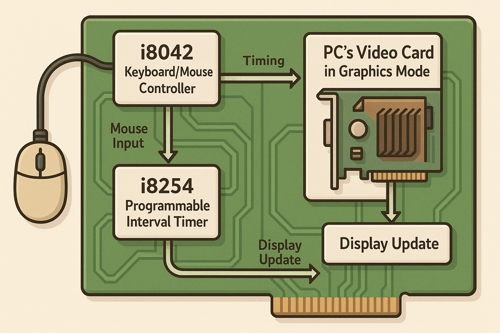

# **LCOM - Laboratório de Computadores (2º Semestre, 2025)**

Neste repositório podes encontrar guiões completos para todos os labs da cadeira de Laboratório de Computadores, incluindo detalhes sobre a matéria abordada, como aplicar na prática e ainda modelos que podes transferir e construir o teu lab a partir dos mesmos. Todo o código dos labs está 100% funcional, contudo não recomendo a cópia do conteúdo dos mesmos. Além disso, os guiões e comentários de código estão feitos em português para facilitar a compreensão da esmagadora maioria dos discentes.

Apesar da complexidade de alguns labs, a compreensão dos mesmos não deverá ser difícil se for feita uma leitura atenta dos guiões que acompanham cada um deles.
> Se detetares erros, informação em falta, algo que poderia estar 'mais bem explicado' ou mesmo após a leitura atenta dos guiões dos respetivos labs continuares com dúvidas, por favor abre uma [discussão](https://github.com/tiagoleic02/LCOM/discussions/new/choose).

- [**Lab0 - Introdução à Linguagem C e ao MINIX/LCOM**](https://github.com/tiagoleic02/lcom/tree/master/Labs/lab0)
- [**Lab2 - i8254, the PC's Timer**](https://github.com/tiagoleic02/lcom/tree/master/Labs/lab2)
- [**Lab3 - i8042, the PC Keyboard and its Controller**](https://github.com/tiagoleic02/lcom/tree/master/Labs/lab3)
- [**Lab4 - The PS/2 Mouse**](https://github.com/tiagoleic02/lcom/tree/master/Labs/lab4)
- [**Lab5 - The PC's Video Card in Graphics Mode**](https://github.com/tiagoleic02/lcom/tree/master/Labs/lab5)

  
  
Alguns dos dispositivos que serão alvo de trabalho nesta cadeira. Elaborado com IA.

## Agradecimentos e Referências
Deixo um agradecimento especial ao monitor [Rubem Neto](https://pt.linkedin.com/in/rubem-neto-62951122b) pelo apoio que me foi prestado nas aulas práticas desta cadeira e ao [Fabio Sá](https://www.linkedin.com/in/fabio-a-sa) pelo seu inestimável contributo com o seu repositório que certamente salvou uma grande fatia dos estudantes de uma cadeira com uma avaliação particularmente dificil e materiais de apoio dificeis de compreender.